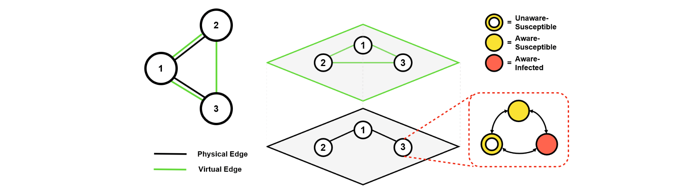

# Tool overview

The tool is designed alongside the formal language for modelling multilayer networks.

The aim of the tool is to provide an easy way of visualising and analysing the modelled network, as well as simulating using a variety of options based on established methods such as Gillespie and Kappa. Implementation of additional features (e.g. model reduction techniques, etc.) is also planned.

Furthermore, the tool will have a number of domain-specific case studies included out-of-the-box, serving as a demonstration of the capabilities of the modelling language and the tool itself.

 

In this overview, we will examine a simple 3-node, 2-layer network which aims to describe the spreading process of an epidemic. One layer represents the physical interactions between nodes, the other - virtual interactions (e.g. dissimenation of information on a social network). Infection is possible in the physical layer, whereas infection awareness travels in the virtual layer. A node that was made *aware* in the virtual layer is less likely to become *infected* in the physical layer.



## Input files

In its current implementation, the tool expects a pair of files as input: a **.txt** file containing the edge definitions of the network, and an **.mln** file containing the formal definition of the model.

The network model described in the figure above would have the following edge definitions (start node, end node, layer):

**network.txt**
```
1,2,1
1,3,1
1,2,2
1,3,2
2,3,2
```

The second input file contains the model definition, including possible states, parameters and rates, interaction rules, initial conditions, and other additional options.

The differentiating factor of the language is the ability to describe intra- and inter-layer rules. We can then specify interaction rules for each layer.

In our case, we would like to begin with a single *infected* node and two *unaware susceptible* nodes. We would also like to observe the simulation results for all three states, with $n = 1000$ iterations.

Taking the above into account, the model definition file is then:

**language.mln**
```
begin states
AS
AI
US
end states

begin parameters
delta = 1
mu = 1
betaA = 1
betaU = 3
lamb = 1
end parameters

begin initial conditions
1 = AI
2 = US
3 = US
end initial conditions

begin rules
AS -> US @ delta
AI -> AS @ mu
AS =1 AI -> AI =1 AI @ betaA
US =1 AI -> AI =1 AI @ betaU
US =2 AI -> AS =2 AI @ lamb
US =2 AS -> AS =2 AS @ lamb
end rules

begin views
AI
AS
US
end views

begin simOptions
n = 1000
t = 30
end simOptions
```

## Network visualisation

Using the [**uunet**](http://multilayer.it.uu.se/software.html) Python library, we are able to visualise the specified network, including its layers. The current implementation provides a simple mono-colour graphic, though the visualisation capabilities of the package are quite extensive and will be further integrated within the tool.

Our simple example network then looks like this:


## Simulation

Options to export the model configuration to Gillespie CRN and Kappa rule-based languages are implemented. Simulation using the former is available within the tool. Currently, the generated Kappa file needs to be run manually, though integration of the simulation into the tool is planned.

For our example network, the Gillespie simulation yields the following graph with corresponding observables that we specified in the configuration file:


The Kappa simulation, currently run manually, results in the below graph:


The tool can be run using the below command:


```python
!python main.py
```
